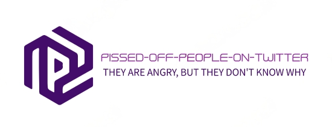
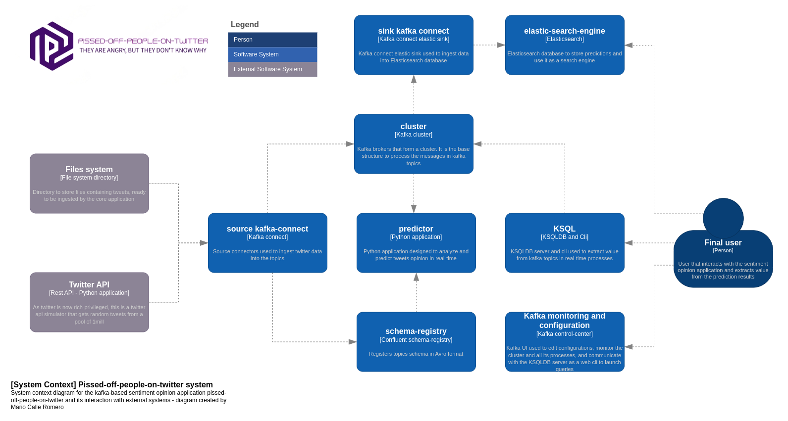

Based on: https://huggingface.co/blog/sentiment-analysis-python

# Architecture (c4 model diagram - System context)

# REST connector

https://stackoverflow.com/questions/60617182/send-data-from-rest-api-to-kafka

Changed pom.xml from [REST connect plugin](https://github.com/llofberg/kafka-connect-rest/tree/master). URL from confluent repo was wrong

# TODO
- Kafka connect elastic sink
- Terminar los diagramas de la arquitectura
- Documentacion

# Apuntes

- Especificar que he utilizado y arreglado el plugin del REST connector (cambiando el pom.xml)
- Especificar necesario fichero de tweets para el conector API
- Detallar la arquitectura