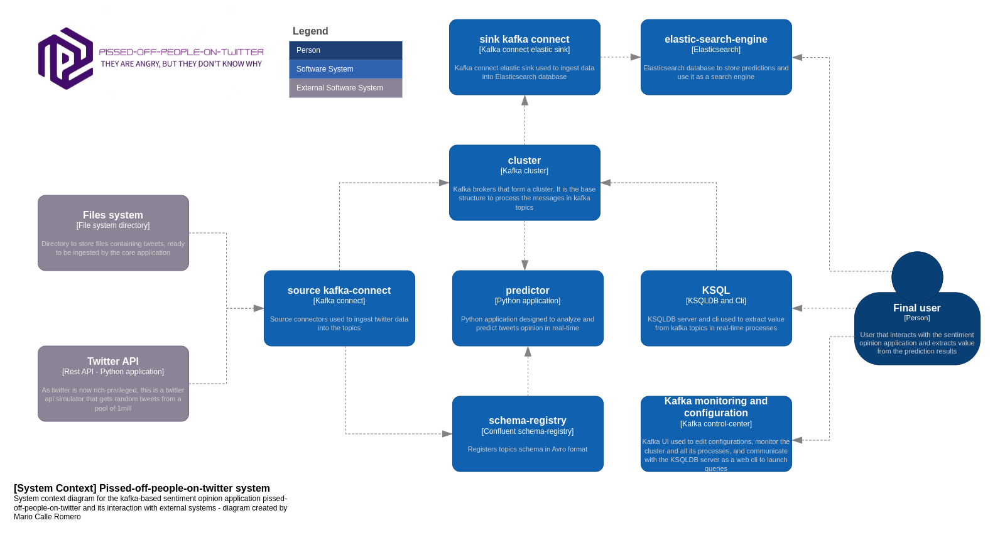

Based on: https://huggingface.co/blog/sentiment-analysis-python

# Documentación
- [Diseño](./doc/design.md)
- [Manual de operación](./doc/operacion.md)
- [Manual de usuario](./doc/manual_uso.md)

# Architecture (c4 model diagram - System context)

Primer nivel de diagrama de arquitectura modelo c4 - System context, en el que se detalla el contexto del sistema con elementos externos y la interrelación de los módulos internos en alto nivel.

# Architecture (c4 model diagram - Containers)

Diagrama de arquitectura modelo c4 - Level 2 - Containers, con mayor nivel de detalle. En este diagrama, además del contexto del sistema, se detallan todos los módulos que intervienen y conforman la aplicación.

# REST connector

https://stackoverflow.com/questions/60617182/send-data-from-rest-api-to-kafka

Changed pom.xml from [REST connect plugin](https://github.com/llofberg/kafka-connect-rest/tree/master). URL from confluent repo was wrong

# TODO
- Kafka connect elastic sink
- Terminar los diagramas de la arquitectura
- Documentacion

# Apuntes

- Especificar que he utilizado y arreglado el plugin del REST connector (cambiando el pom.xml)
- Especificar necesario fichero de tweets para el conector API
- Ejemplo uso ksqldb
- ejemplo uso pantalla kafka ui
- ejemplo uso kibana y elastic
- Detallar la arquitectura