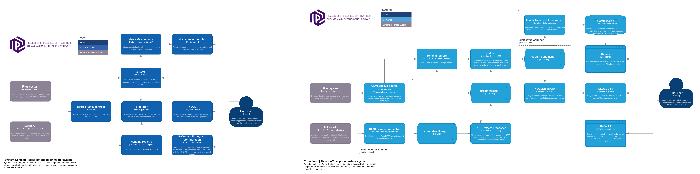

Based on: https://huggingface.co/blog/sentiment-analysis-python

# Architecture (c4 model diagram - System context)

# REST connector

https://stackoverflow.com/questions/60617182/send-data-from-rest-api-to-kafka

Changed pom.xml from [REST connect plugin](https://github.com/llofberg/kafka-connect-rest/tree/master). URL from confluent repo was wrong

# TODO
- Terminar el procesador de api, que recibe un str de una lista de json, tiene que serializar a avro con un esquema (si no existe, crear uno nuevo) y enviar uno a uno los tweets al stream-tweets que ya se encarga de enviar al predictor
- Securizar
- Terminar el server.env
- Terminar los diagramas de la arquitectura
- Kafka connect elastic sink

# Apuntes

- Especificar que he utilizado y arreglado el plugin del REST connector
- Detallar la arquitectura