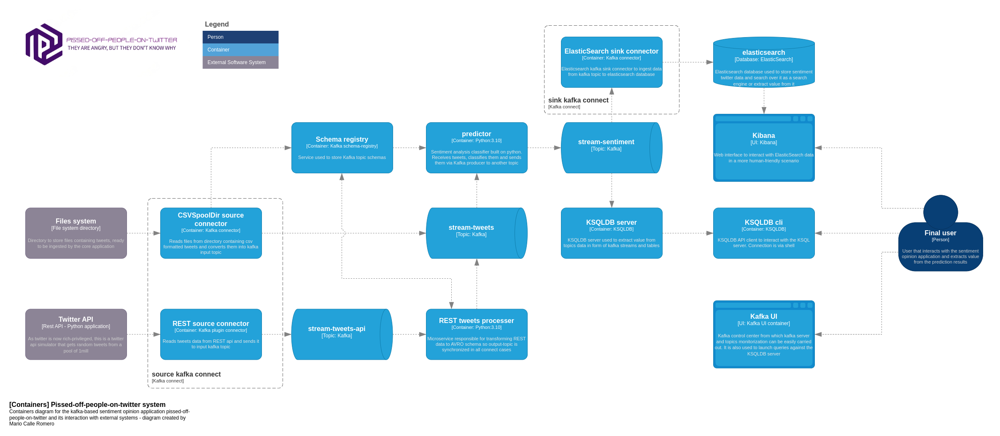

# Arquitectura



# Indice
- [Entrada de datos](#entrada)
    - [Ficheros](#Ficheros)
    - [Twitter API](#tw-api)
    - [REST Connect](#rest-connect)
    - [Twitter API processer](#api-processer)
- [Schema registry](#registry)
- [Predictor](#predictor)
- [Salida](#Salida)
    - [KSQLDB & cli](#ksql)
    - [ElasticSearch & Kibana](#elastic)
- [Kafka UI](#kafka-ui)
- [Paquete de configuración](#configuracion)


# Entrada de datos<a name="entrada"></a>

El objetivo principal de la aplicación consiste en clasificar tweets en tiempo real, basándose en la opinión que transmiten, a medida que son generados en la aplicación de Twitter. La clasificación se realizará en tres categorías: positivo (POS), neutral (NEU) y negativo (NEG). Por consiguiente, se espera que la entrada de datos al sistema sea un flujo continuo de tweets, representando una corriente constante de información.

Se han implementado dos servicios de entrada: mediante **ficheros** en formato _.csv_ y a través de una **API Rest**. La API REST ha sido diseñada para emular las funcionalidades de la herramienta de desarrollo REST de Twitter. Esta decisión se ha tomado debido a que la herramienta de Twitter requiere un pago y proporciona un conjunto demasiado limitado de utilidades para los miembros gratuitos.

## Kafka Connect

Todas las entradas del sistema están construídas bajo un clúster de Kafka Connect. También el Sink Connector de ElasticSearch. Y se puede configurar cuáles de estos conectores se quieren activar o desactivar ([Manual de usuario](manual_uso.md)).

El contenedor del clúster de Kafka connect lanza un script para controlar que el clúster de Kafka se lance antes. Una vez se despliega el clúster de Kafka, se lanza la inicialización de los conectores configurados.

## Ficheros

El primer servicio de entrada ingesta información que proviene de ficheros en formato _.csv_. Para la ingesta de la información se ha integrado un conector de Kafka connect que simplifica la operación de lectura y transformación de los datos. Existen, al menos, dos conectores encargados de ingestar información a través de ficheros: [FileStream](https://docs.confluent.io/platform/current/connect/filestream_connector.html) y [Spool Dir](https://docs.confluent.io/kafka-connectors/spooldir/current/overview.html), pero según la documentación oficial de Confluent se recomienda utilizar el conector Spool Dir en entornos productivos.

[Spool dir recommendation](https://docs.confluent.io/platform/current/connect/filestream_connector.html)
> Confluent does not recommend the FileStream Connector for production use. If you want a production connector to read from files, use a Spool Dir connector.

En la configuración del conector se debe especificar el directorio de lectura de los ficheros, `input.path`; el patrón que sigue el nombre de los ficheros que contienen la información, `input.file.pattern`; directorio de ficheros procesados, `finished.path`, y directorio de ficheros erróneos, `error.path`. Además, se definen otras configuraciones relevantes al comportamiento del conector como la desactivación de parada del sistema ante errores, el carácter de escape que se utiliza en la información leída (se especifica a 0 porque es el carácter nulo. Muchos tweets contienen ':\' para representar estados de ánimo, lo cuál hace que se escape el carácter que delimita los tweets causando errores en la lectura de los ficheros). También se especifica el esquema AVRO con el que se convierten los mensajes al ser trasmitidos al topic.

```json
{
    "name": "CsvSpoolDir",
    "config": {
        "tasks.max": "1",
        "connector.class": "com.github.jcustenborder.kafka.connect.spooldir.SpoolDirCsvSourceConnector",
        "input.path": "/data/input",
        "input.file.pattern": "^tweets_.*\\.csv",
        "error.path": "/data/error",
        "finished.path": "/data/processed",
        "halt.on.error": "false",
        "topic": "stream-tweets",
        "csv.first.row.as.header": "true",
        "csv.escape.char": 0,
        "schema.generation.enabled": "true",
        "key.schema": "{\n    \"name\":\"stream.tweets.key.schema\",\n    \"type\":\"STRUCT\",\n    \"isOptional\":false,\n    \"fieldSchemas\":{\n       \"id\":{\n          \"type\":\"INT64\",\n          \"isOptional\":false\n       }\n    }\n }",
        "value.schema": "{\n   \"name\":\"stream.tweets.value.schema\",\n   \"type\":\"STRUCT\",\n   \"isOptional\":false,\n   \"fieldSchemas\":{\n      \"id\":{\n         \"type\":\"INT64\",\n         \"isOptional\":false\n      },\n      \"user\":{\n         \"type\":\"STRING\",\n         \"isOptional\":true\n      },\n      \"date\":{\n         \"type\":\"STRING\",\n         \"isOptional\":true\n      },\n      \"tweet\":{\n         \"type\":\"STRING\",\n         \"isOptional\":true\n      }\n   }\n}"
    }
}
```

La especificación del esquema que siguen los mensajes suprime la necesidad de ingestar mensajes para inducir o generar un nuevo esquema. Es importante, sin embargo, que los datos de los ficheros que se consumen sigan un patrón común. El patrón que se ha decidido es el siguiente:

```
id,date,user,tweet
1467810369,Mon Apr 06 22:19:45 PDT 2009,_TheSpecialOne_,"@switchfoot http://twitpic.com/2y1zl - Awww, that's a bummer.  You shoulda got David Carr of Third Day to do it. ;D"
```

## Twitter API<a name="tw-api"></a>

El kit de desarrollador de Twitter es de pago y la funcionalidad accesible de forma gratuita está limitada a la lectura de 1000 tweets. Por estas razones se ha desarrollado una API que emula la generación de tweets cada ciertos segundos. El funcionamiento es muy sencillo y su carácter es exclusivamente de desarrollo y pruebas.

Cada vez que se realiza una llamada al endpoint `GET /tweets` se leen aleatoriamente entre 1 y 10 tweets de un conjunto de datos (que debe ser especificado durante el arranque del servicio). La única configuración posible es la ruta de lectura del fichero de datos que contiene los tweets. Se puede especificar como variable de entorno `TWEETS_FILE_PATH` o con un fichero de configuración adicional en formato yaml. Se puede utilizar un fichero de configuración indicando la ruta del fichero con la variable de entorno `CONFIG_PATHS`. ([Configuración](operacion.md#Configuración)).

Ejemplo de configuración:
```yaml
tweets:
  path: tweets_processed.csv
```

La imagen del servicio está construída sobre Python 3.10 y utiliza FastAPI.

## REST Connect<a name="rest-connect"></a>

No existe un conector oficial para el consumo de endpoints de API REST de Kafka, sin embargo, sí existe un [plugin, creado por Lenny Löfberg](https://github.com/llofberg/kafka-connect-rest/tree/master), con esta funcionalidad. Este conector lanza una petición contra un servicio REST, contra un endpoint concreto, separadas por un intervalo de tiempo especificado en su configuración, `rest.source.poll.interval.ms`. El repositorio del plugin se encuentra en un estado desactualizado, por lo que hay un problema en la configuración de maven que es necesario modificar. Concretamente hay que modificar la versión de confluent y la URL en las propiedades del `pom.xml`:

```xml
<confluent.version>5.2.1</confluent.version>
<confluent.maven.repo>https://packages.confluent.io/maven/</confluent.maven.repo>
```

Configuración del conector REST:

```json
{
    "name": "RESTSource",
    "config": {
        "connector.class": "com.tm.kafka.connect.rest.RestSourceConnector",
        "rest.source.poll.interval.ms": "10000",
        "rest.source.method": "GET",
        "rest.source.headers": "Content-Type:application/json,Accept:application/json",
        "rest.source.url": "http://twitter-api:8099/tweets",
        "rest.source.topic.selector": "com.tm.kafka.connect.rest.selector.SimpleTopicSelector",
        "rest.source.destination.topics": "stream-tweets-api"
    }
}
```

Dado que se trata de un plugin, es imprescindible instalarlo en la imagen para su posterior utilización. Por lo tanto, la imagen de Kafka Connect que se emplea se ha diseñado como una imagen multi-stage. En esta imagen, primero se construye el plugin y luego se instala su para habilitar su funcionalidad.

## Twitter API processer<a name="api-processer"></a>

Se ha implementado un servicio que agrega un esquema a los mensajes generados por el conector de REST. Este servicio utiliza un Kafka Consumer para leer los mensajes del topic de salida del conector de REST. Recibido el primer mensaje del topic, este servicio conecta con el schema registry para recuperar, si existe, el esquema de escritura con el que se deben serializar los mensajes que entran al topic del que consume el predictor. Si no existe el esquema, lo crea y serializa los mensajes. Aunque la configuración de este servicio se puede consultar en el documento de operación del sistema, cabe reseñar la necesidad de configurar el esquema de los mensajes de salida:

```yaml
schemas:
  output_schema: |-
    {
      "name":"stream.tweets.value.schema",
      "type":"record",
      "isOptional": false,
      "fields": [
        {
          "name": "id",
          "type":"int",
          "isOptional": false
        },
        {
          "name": "user",
          "type":"string",
          "isOptional": true
        },
        {
          "name": "date",
          "type":"string",
          "isOptional": true
        },
        {
          "name": "tweet",
          "type":"string",
          "isOptional": true
        }
      ]
    }
```

## Interdependencias de conectores

Con el objetivo de mantener un servicio fácilmente operable, tanto el conector de ficheros como el conector REST (junto al procesador), pueden generar esquemas AVRO de los mensajes. Ambos conectores comparten el topic de entrada al predictor, por lo que todos los mensajes deben mantener un esquema común, sin embargo, no es necesario que ambos conectores se activen, por lo que no hay forma de controlar durante el arranque de la aplicación que uno de los conectores sea el encargado de generar el esquema del topic. El conector de ficheros siempre va a crear un esquema de los mensajes. Esta es principalmente la razón por la que se ha decidido implementar el servicio `Twitter API processer`, para gestionar la creación o descarga del esquema de los mensajes. Si se genera un nuevo esquema en el processer y se activan ambos conectores, es necesario que el esquema sea compatible con el que es generado por el conector de ficheros.

Como apunte adicional, el esquema del conector Spool Dir no sigue el estándar de los esquemas AVRO y no he logrado comprender las razones para ello, aunque entiendo que pueda ser por compatibilidad con otros tipos de esquemas como Protobuf o JSON. Esto hace que haya que mantener especial cuidado con el mantenimiento de los esquemas, pues podría romper la compatibilidad con los otros conectores.

Esquema del conector Spool Dir:
```json
{
    "name":"stream.tweets.value.schema",
    "type":"STRUCT",
    "isOptional":false,
    "fieldSchemas":{
        "id":{
            "type":"INT64",
            "isOptional":false
        },
        "user":{
            "type":"STRING",
            "isOptional":true
        },
        "date":{
            "type":"STRING",
            "isOptional":true
        },
        "tweet":{
            "type":"STRING",
            "isOptional":true
        }
    }
}
```

# Schema registry<a name="registry"></a>

El servicio de Schema Registry se han integrado con el objetivo de poder serializar los mensajes de entrada del predictor con esquemas AVRO, como se explica en el punto anterior de este mismo documento. Los esquemas almacenados se pueden consultar haciendo uso de la interfaz de control [Kafka UI](#kafka-ui).

# Predictor<a name="predictor"></a>

El servicio del predictor realiza una clasificación del sentimiento que transmiten los tweets que recibe. La clasificación puede ser positivo, negativo o neutral. El servicio del predictor utiliza principalmente la funcionalidad descrita en [https://huggingface.co/blog/sentiment-analysis-python](https://huggingface.co/blog/sentiment-analysis-python). Se trata de un modelo de predicción previamente entrenado para la clasificación de tweets.

El flujo del predictor es el siguiente: consume los tweets del topic de entrada mediante Kafka Consumer, recupera el esquema con el que se serializaron del Schema Registry, deserializa el mensaje y lo transforma a una clase interna sobre la que realiza pequeñas transformaciones, principalmente un pequeño parseo de la fecha de generación del tweet; después, realiza la predicción del sentimiento del tweet y lo envía a un nuevo topic mediante un Kafka Producer.

La imagen de predicción es muy pesada por la utilización de PyTorch, aproximadamente 7GB.

# Salida

El predictor se encarga de detectar el sentimiento de los tweets y enviarlos a un topic de Kafka. La etapa final de la aplicación consiste en consumir y aprovechar las predicciones generadas. Para lograr esto, se han integrado varios servicios que permiten extraer valor de las predicciones y aplicar análisis a la información obtenida.

## ElasticSearch & Kibana<a name="elastic"></a>

La funcionalidad clave en muchas aplicaciones actuales es el buscador, el cual desempeña un papel fundamental en el consumo de información, especialmente cuando se deben realizar análisis de texto libre. Por esta razón, ElasticSearch resulta extremadamente valioso para extraer información de redes sociales como Twitter, cuyo contenido principal consiste en texto libre. ElasticSearch ofrece una potente API de consultas de texto libre, aunque también permite realizar consultas en los campos almacenados. Sin embargo, el acceso directo a la información en ElasticSearch puede resultar complejo y tedioso. Por tanto, se ha tomado la decisión de también instanciar el servicio de Kibana, el cual simplifica considerablemente las consultas en ElasticSearch. Además, en Kibana se pueden crear paneles de control que facilitan la visualización de las consultas agregadas.

La ingesta de información se realiza a través de un Sink Connector de Kafka. Concretamente, el conector es `ElasticsearchSinkConnector`. Este conector consume los mensajes de un topic, en el caso de este sistema lo consume del topic de salida del predictor, y los ingesta en un índice de ElasticSearch.

## KSQLDB & cli<a name="ksql"></a>

Otro mecanismo útil de consumo de la información es mediante KSQLDB, ya que con este servicio podemos analizar la información directamente sobre Kafka Streams del topic, sin necesidad de bases de datos adicionales. La principal característica de este servicio es el consumo de la información en tiempo real. En este proyecto se ha implementado para poder consumir información directamente sobre el topic de salida del predictor a medida que se realizan las predicciones. También se ha implementado un contenedor de KSQLDB Cli para lanzar consultas contra la API de KSQLDB.

# Kafka UI<a name="kafka-ui"></a>

Controlar el funcionamiento de la aplicación en todo momento ha sido algo primordial para el desarrollo y la operación de la herramienta. Para llevar a cabo toda la monitorización a alto nivel del sistema, se ha utiliza kafka-ui, una imagen que se conecta al clúster de Kafka para mostrar toda la información relacionada con los brokers, topics y sistemas adicionales como el schema registry y KSQLDB.

Además de poder ver todos los mensajes almacenados en los topics, Kafka UI nos permite tanto ver como editar la configuración de nuestros recursos a través de una sencilla interfaz web. También nos permite controlar los esquemas y sus versiones almacenados en el Schema Registry y, no sólo eso, sino que además tiene la característica de poder lanzar consultas contra nuestro servidor de KSQLDB.

# Paquete de configuración<a name="configuracion"></a>

Las imágenes generadas internamente del predictor, el procesador de los mensajes REST y el simulador de la API REST de Twitter utilizan un paquete de Python `configuration` que se ha implementado para poder hacer un uso más dinámico de las configuraciones internas de la aplicación. Este paquete se encarga de leer un fichero de configuración en formato .yaml que contiene los parámetros por defecto de la aplicación, pero también admite ficheros extra de configuración que sobreescriben los parámetros por defecto. Esta configuración está pensada para ser editada por el operador de la aplicación.

Además, este paquete admite que los parámetros sean enviados vía variables de entorno, y estas tienen prioridad sobre la configuración de los ficheros yaml. Por ejemplo, el parámetro que indica el nombre del fichero de tweets del simulador de la API de twitter puede indicarse por variable de entorno `TWEETS_FILE_PATH` o en un fichero yaml como:

```yaml
tweets:
  path: tweets_processed.csv
```