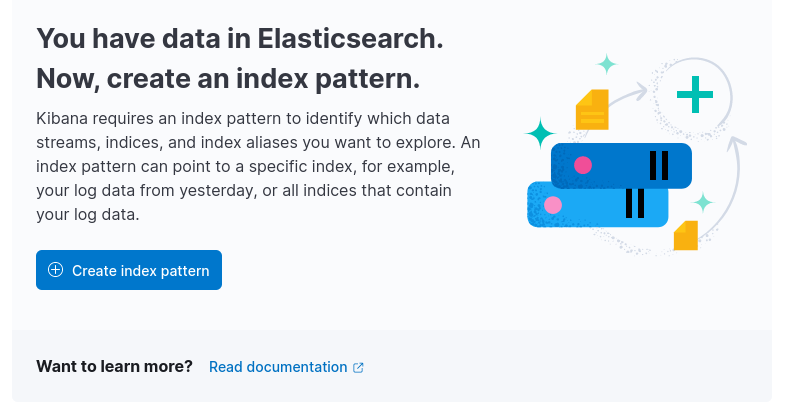
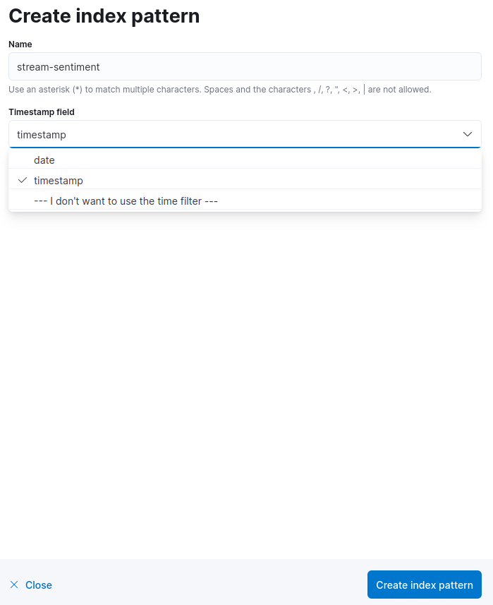

# Configuración de usuario

Toda la configuración de usuario se encuentra en el fichero `run.env`. La configuración se define por variables de entorno y se pueden configurar los siguientes parámetros de la aplicación:

General:
- **_VERSION_**: Versión de la aplicación. Influye principalmente en el tag de algunas imágenes. Podría ser automatizada para entornos productivos.
- **_DEFAULT_NUMBER_OF_PARTITIONS_**: Establece el número por defecto de particiones de todos los topics de la aplicación. Influye en la calidad de paralelización que queramos para nuestra aplicación. El valor por defecto es 3.
- **_KAFKA_UI_CONFIG_PATH_**: Ruta de configuración para la interfaz Kafka UI.

Conectores:
- **_CONNECT_FILES_ENABLE_**: true o false. Indica si queremos desplegar este conector.
- **_TWITTER_API_ENABLE_**: true o false. Indica si queremos desplegar este conector.
- **_ELASTICSEARCH_ENABLE_**: true o false. Indica si queremos desplegar este conector.
- **_FILES_INPUT_PATH_**: Ruta local de ficheros de entrada para el conector de ficheros. Los ficheros que se encuentren en este directorio van a ser procesados por el conector. Es un parámetro obligatorio si CONNECT_FILES_ENABLE es true. **La ruta debe tener permisos de lectura y de escritura.**
- **_FILES_ERROR_PATH_**: Ruta local de ficheros con errores de lectura para el conector de ficheros. Es un parámetro obligatorio si CONNECT_FILES_ENABLE es true. **La ruta debe tener permisos de lectura y de escritura.**
- **_FILES_PROCESSED_PATH_**: Ruta local de ficheros que han sido procesados por el conector de ficheros. Es un parámetro obligatorio si CONNECT_FILES_ENABLE es true. **La ruta debe tener permisos de lectura y de escritura.**
- **_API_TWEETS_DIRECTORY_**: Ruta del directorio donde se encuentra el fichero de tweets sobre los que la API selecciona aleatoriamente tweets para enviarlos al topic de predicciones.
- **_TWEETS_FILE_PATH_**: Nombre del fichero de tweets para la API que simula la generación de tweets.

Resto de servicios:
- **_ELK_N_REPLICAS_**: Número de réplicas del servicio de ElasticSearch. Este parámetro debe ser siempre igual o menor que DEFAULT_NUMBER_OF_PARTITIONS para una paralelización óptima de los procesos. Se recomienda poner a 0 si el conector de ElasticSearch no se instancia.
- **_PREDICTOR_N_REPLICAS_**: Número de réplicas del servicio de predicción. Este parámetro debe ser siempre igual o menor que DEFAULT_NUMBER_OF_PARTITIONS para una paralelización óptima de los procesos.
- **_PROCESSER_N_REPLICAS_**: Número de réplicas del servicio que procesa los mensajes recibidos por el conector REST. Este parámetro debe ser siempre igual o menor que DEFAULT_NUMBER_OF_PARTITIONS para una paralelización óptima de los procesos.


# Ingesta de datos

Como se tienen que poner los ficheros de datos (cabecera y formato csv...)

Los ficheros de tweets deben ser en formato _.csv_ y deben tener una cabecera. El formato esperado de los ficheros de tweets es el siguiente:

```
id,date,user,tweet
1467810369,Mon Apr 06 22:19:45 PDT 2009,_TheSpecialOne_,"@switchfoot http://twitpic.com/2y1zl - Awww, that's a bummer.  You shoulda got David Carr of Third Day to do it. ;D"
```

Se espera que la fecha esté en el formato: `%a %b %d %H:%M:%S PDT %Y` como por ejemplo: `Mon Apr 06 22:19:45 PDT 2009`. La zona horaria por defecto es "America/Los Angeles". También admite cualquier fecha en formato ISO que incluya zona horaria, como por ejemplo: `2023-06-25T16:46:47+02:00`. Todas las fechas se almacenan en UTC de forma interna.

# Consumo de resultados

## Kibana

Por defecto, el servidor de Kibana se levanta en el puerto 5601. Para acceder, basta con poner en nuestro navegador: [https://localhost:5601](https://localhost:5601)

Ejemplo de utilización de la interfaz de Kibana para el consumo de resultados de ElasticSearch:

1. Panel de análisis de Kibana > Discover


1.1. Si es la primera vez, se debe configurar el índice.





2. Pantalla discover. A la derecha, arriba, se encuentra el selector de tiempo para la consulta.


Construcción de Dashboards:


## KSQLDB Cli

Para acceder al cliente de consultas de KSQLDB hay que ejecutar el siguiente comando: `docker exec -it ksqldb-cli ksql http://ksqldb-server:8088`

Una vez dentro de la terminal podemos lanzar consultas para interactuar con la información almacenada en el topic de salida del predictor. Para ejemplificar el uso que le podemos dar se pueden generar un Stream y una tabla:


Para ver el comportamiento de nuestra tabla en tiempo real podemos lanzar un simple select en un intervalo de unos segundos:


Podemos ver el comportamiento de nuestras consultas a Streams. En el siguiente ejemplo podemos ver aquellos tweets positivos que se están generando en tiempo real en nuestra aplicación:


## Kafka UI - KSQL

Las consultas de KSQLDB también se pueden realizar mediante la interfaz gráfica de Kafka UI. Para acceder a Kafka UI podemos escribir la siguiente URL en nuestro navegador de confianza: [https://localhost:8080](https://localhost:8080).

Una vez dentro, accedemos al apartado de KSQL DB para lanzar consultas.

